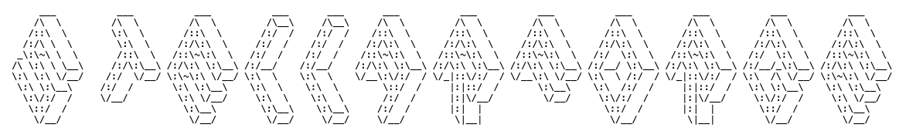

# Stellar-Forge

## Project Description & Requirements
### Project Overview
A modern Python-based data generation and streaming platform that produces realistic, configurable synthetic data and writes it to multiple relational databases. The project enables developers, data engineers, and analysts to quickly spin up realistic data pipelines for testing, learning, and development purposes without relying on production data.

**Key Use Cases**

- Database Exploration: Test and benchmark different relational databases (PostgreSQL, MySQL, SQL Server, etc.) with realistic workloads
- Analytics Pipeline Development: Build and test data ingestion pipelines
- Streaming Analytics: Develop and validate real-time analytics solutions with configurable data streams
- Development Environment Mocking: Replace production database connections with synthetic data generators for safe development and testing
- Performance Testing: Generate configurable data volumes to test database performance and query optimization

## Core Requirements
1. Architecture

Microservices-based: Separate services for data generation, database writers, and orchestration
Containerized: Full Docker Compose setup for local development
Cloud-Ready: Deployable to AWS (ECS/EKS), Azure (Container Apps/AKS), and GCP (Cloud Run/GKE)
Scalable: Support for multiple concurrent data streams and database targets

2. Python Package Design

Installable Package: Available via pip install (PyPI distribution)
Configuration-as-Code: Users define data models, schemas, and targets in Python
Extensible: Plugin architecture for custom data generators and database connectors
Type-Safe: Full type hints and runtime validation using Pydantic

3. Data Generation

Schema Definition: Declarative data model definitions with relationships
Realistic Data: Integration with Faker or similar libraries for authentic synthetic data
Configurable Rates: Control data generation frequency (records per second/minute)
Data Patterns: Support for time-series, transactional, and event-based patterns
Relationships: Maintain referential integrity across related tables

4. Database Support

Multiple Databases: PostgreSQL, MySQL, SQL Server, SQLite (initial targets)
Extensible Connectors: Easy addition of new database types
Batch & Streaming: Support both batch inserts and streaming writes
Connection Pooling: Efficient database connection management
Error Handling: Retry logic and dead letter queues for failed writes

5. Streaming Capabilities

Message Queues: Integration with Kafka, RabbitMQ, or Redis Streams
Configurable Topology: Define data flow between generators and targets
Backpressure Handling: Graceful handling of downstream bottlenecks
Observability: Metrics on generation rates, write throughput, and errors

6. Developer Experience

Simple Setup: docker compose up for instant local environment
Clear Documentation: Comprehensive guides and examples
CLI Tool: Command-line interface for common operations
Hot Reload: Configuration changes without service restarts
Health Checks: Built-in service health monitoring

7. Observability

Logging: Structured logging with configurable levels
Metrics: Prometheus-compatible metrics exposure
Tracing: Optional OpenTelemetry integration
Monitoring Dashboards: Pre-built Grafana dashboards

8. Modern Python Tooling

Package Management: uv for dependency management
Code Quality: Ruff for linting and formatting
Type Checking: ty for static type analysis
Testing: pytest with comprehensive test coverage
Documentation: MkDocs for API documentation
CI/CD: GitHub Actions workflows for testing and publishing

Technical Stack

Python: 3.114
Frameworks: FastAPI (API services), Pydantic (validation), SQLAlchemy (database ORM)
Containerization: Docker, Docker Compose
Orchestration: TBC (is it needed??)
Data Generation: Faker, Mimesis
Databases: PostgreSQL, MySQL, SQL Server drivers
Messaging: kafka-python, pika (RabbitMQ), redis